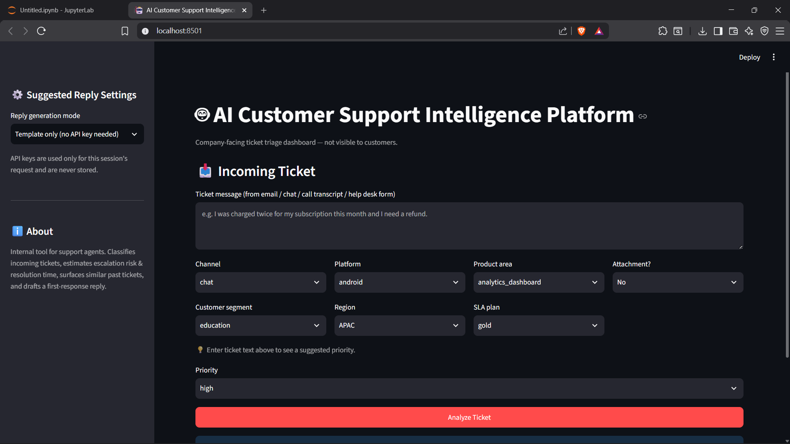
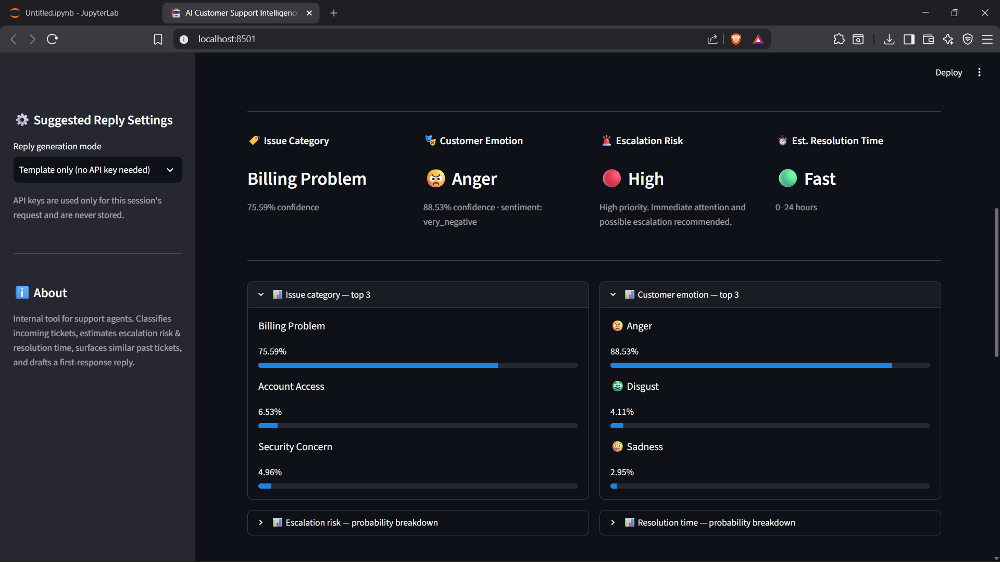
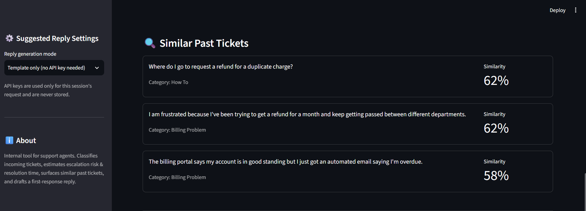
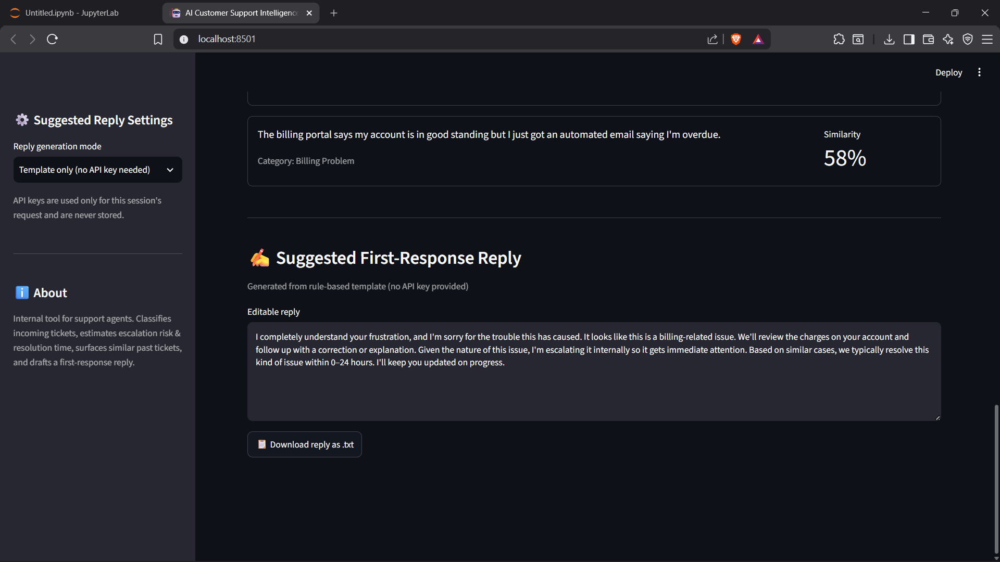

# 🤖 AI Customer Support Intelligence Platform

> **An AI-powered customer support triage system that automatically classifies incoming tickets, detects customer emotions, predicts escalation risk and resolution time, retrieves similar historical tickets, and generates an AI-assisted first response — all from a single customer complaint.**

---

## 📸 Application Preview

### Home Interface



### AI Prediction Dashboard



### Similar Historical Ticket Retrieval



### AI Suggested Response



---

# 🚀 Features

- ✅ Fine-tuned **DistilBERT** Issue Classification
- ✅ Fine-tuned **DistilBERT** Emotion Detection
- ✅ Customer Sentiment Derivation
- ✅ Escalation Risk Prediction using **XGBoost**
- ✅ Resolution Time Prediction using **XGBoost**
- ✅ Similar Historical Ticket Retrieval using **Sentence Transformers + k-NN**
- ✅ AI Suggested First Response (Claude / GPT or Rule-based)
- ✅ Interactive Streamlit Dashboard
- ✅ End-to-End Machine Learning Pipeline

---

# 🧠 AI Pipeline

```
Incoming Customer Ticket
            │
            ▼
Issue Classification (DistilBERT)
            │
            ▼
Emotion Detection (DistilBERT)
            │
            ▼
Derived Customer Sentiment
            │
            ▼
Resolution Time Prediction (XGBoost)
            │
            ▼
Escalation Risk Prediction (XGBoost)
            │
            ▼
Similar Historical Ticket Retrieval
            │
            ▼
AI Suggested First Response
```

---

# 🏗️ Project Overview

Built as an end-to-end Machine Learning & Deep Learning pipeline:

- Data Validation
- Data Cleaning
- Exploratory Data Analysis
- Feature Engineering
- Model Training
- Similarity Search
- Streamlit Deployment
- LLM-assisted Response Generation

The platform is designed as an **internal decision-support tool for customer support agents**, enabling faster and more consistent ticket triage.

---

# 🤖 Models Used

| Task | Model | Approach |
|------|------|------|
| Issue Category | DistilBERT (Fine-tuned) | Multi-class text classification |
| Customer Emotion | DistilBERT (Fine-tuned) | GoEmotions → Ekman emotion mapping |
| Priority | Rule-based Engine | Keyword + SLA + Customer Segment |
| Escalation Risk | XGBoost | Multi-class classification |
| Resolution Time | XGBoost | Multi-class classification |
| Similar Ticket Retrieval | Sentence Transformers + k-NN | Cosine Similarity Search |
| AI Suggested Reply | Claude / GPT (Optional) or Rule-based | Context-aware response generation |

---

# 🛠️ Tech Stack

### Machine Learning

- DistilBERT
- XGBoost
- Sentence Transformers
- Scikit-learn

### NLP

- Hugging Face Transformers
- Tokenizers
- Cosine Similarity

### Data Processing

- Pandas
- NumPy

### Visualization

- Matplotlib
- Plotly

### Frontend

- Streamlit

### Development

- Python
- Jupyter Notebook

---

# 📂 Project Structure

```text
AI-Customer-Support-Intelligence-Platform/

├── streamlit_app/
│   ├── app.py
│   ├── utils.py
│   └── llm_response.py
│
├── notebooks/
│   ├── 00_dataset_validation.ipynb
│   ├── 01_data_cleaning.ipynb
│   ├── 02_eda.ipynb
│   ├── 03_ai_pipeline.ipynb
│   ├── 04_LLM_dataset.ipynb
│   ├── 05_distilbERT_issue.ipynb
│   ├── 06_resolution_time_prediction.ipynb
│   ├── 07_escalation_risk_pred.ipynb
│   ├── 08_similar_ticket_knn.ipynb
│   └── 09_emotion_detection.ipynb
│
├── models/
├── data/
│   ├── raw/
│   ├── processed/
│   └── generated/
│
├── screenshots/
│
├── README.md
├── requirements.txt
├── .gitignore
└── LICENSE
```

---

# ⚙️ Installation

Clone the repository

```bash
git clone https://github.com/<your-username>/<repo-name>.git
cd <repo-name>
```

Create a virtual environment

```bash
python -m venv venv
```

Activate it

### Windows

```bash
venv\Scripts\activate
```

### Linux / macOS

```bash
source venv/bin/activate
```

Install dependencies

```bash
pip install -r requirements.txt
```

Run the application

```bash
streamlit run streamlit_app/app.py
```

---

# 📁 Data & Models

The `data/` and `models/` folders are **not tracked in Git** because they contain large generated artifacts.

To reproduce the complete pipeline:

1. Place the raw dataset inside

```
data/raw/
```

2. Execute the notebooks sequentially

```
00 → 09
```

Each notebook automatically generates the required datasets and trained models for the next stage.

---

# 🤖 AI Suggested Response

The application supports two reply generation modes:

- Rule-based templates (works without an API key)
- Claude / GPT integration (optional)

If using an LLM, choose the provider from the sidebar and provide your API key.

API keys are only used during the current session and are never stored.

---

# 📖 Notes on Modeling Choices

This project intentionally makes several engineering decisions to better reflect real-world machine learning practices.

### Priority Prediction

Priority is **rule-based**, not a trained ML model.

Analysis showed that the provided dataset contained no meaningful relationship between priority and the available ticket features. Rather than train a model on noise, the application generates a transparent recommendation using keywords, SLA level, and customer segment.

---

### Escalation Risk

The dataset does not contain real escalation labels.

A synthetic proxy label was created using domain-inspired business rules. The notebook includes comparisons against the underlying rule baseline to demonstrate the added value of the trained model.

---

### Emotion Detection

The emotion classifier is trained on the **GoEmotions** dataset rather than customer support tickets because no publicly available ticket dataset contains emotion annotations.

Performance metrics therefore reflect evaluation on GoEmotions and should not be interpreted as production customer-support accuracy.

---

# 🔮 Future Improvements

- Real-time helpdesk integration
- Multi-language support
- Retrieval-Augmented Generation (RAG)
- Fine-tuning using production support tickets
- Power BI analytics dashboard
- Agent performance analytics
- Automatic ticket summarization

---

# 📜 License

This project is licensed under the **MIT License**.

---

# 👨‍💻 Author

**Shristy Shreya**

Electronics & Communication Engineering  
Birla Institute of Technology, Mesra

Interested in:

- Artificial Intelligence
- Machine Learning
- Natural Language Processing
- Intelligent Customer Support Systems

---

⭐ If you found this project useful, consider giving it a star!